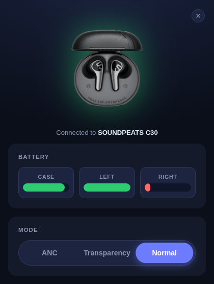
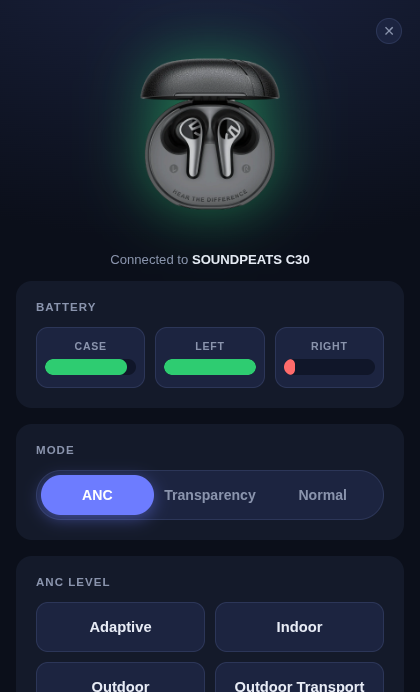
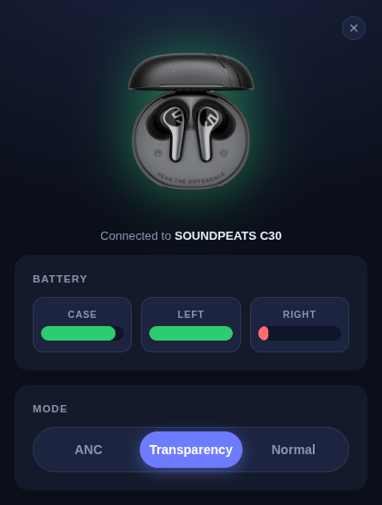

# SOUNDPEATS C30 Controller


## Context
The **SOUNDPEATS C30** ships with a phone app, but there's no desktop
counterpart, and on Linux there's no supported way to change its ANC modes at all.
This project fixes that by providing an interface that talks to
the earbuds over Bluetooth Classic and brings the same controls to the desktop.

The C30's companion app controls the earphones over a Bluetooth serial (RFCOMM)
link using a proprietary, undocumented command protocol. With no public
documentation available, the protocol was worked out by capturing and decoding
the app's Bluetooth traffic, layer by layer, until the commands behind
each feature (mode switching, battery levels...) were identified.

## Screenshots

| Normal mode | ANC mode | Transparency mode |
|:---:|:---:|:---:|
|  |  |  |

## Requirements

- Linux with **BlueZ** (`bluetoothctl`)
- The C30 paired/trusted with the system once, the app detects it by name.

## Run

```bash
npm install
npm start
```

## Build

```bash
npm run dist        # AppImage + .deb → dist/
```

> AppImages need FUSE 2 (`libfuse.so.2`). Install it (`sudo apt install libfuse2`
> / `sudo pacman -S fuse2`) or run with `--appimage-extract-and-run`.

## How it works

The app polls BlueZ for connected devices, recognizes the C30 by name, and opens
an RFCOMM channel to send the earphones' proprietary SPP commands:

```
ff 04 00 LL 00 0a 03 CMD [PAYLOAD]
```

### Supported commands

Commands sent to the earphones to change a setting:

| Mode | Command |
|------|---------|
| Normal | `0x11 00` |
| ANC | `0x11 01` |
| Transparency | `0x11 02` |
| Adaptive | `0x25 11` |
| Indoor | `0x25 12` |
| Outdoor | `0x25 13` |
| Outdoor Transport | `0x25 14` |

### Supported queries

Queries that read the current state from the earphones:

| Query | Request | Response payload |
|-------|---------|------------------|
| Left earbud battery | `0x06` | `[status, percent]` |
| Right earbud battery | `0x07` | `[status, percent]` |
| Charging case battery | `0x23` | `[status, percent]` |
| Current mode | `0x10` | `[status, mode]` |

## License

MIT © [AhmedSahbaoui69](https://github.com/AhmedSahbaoui69)
